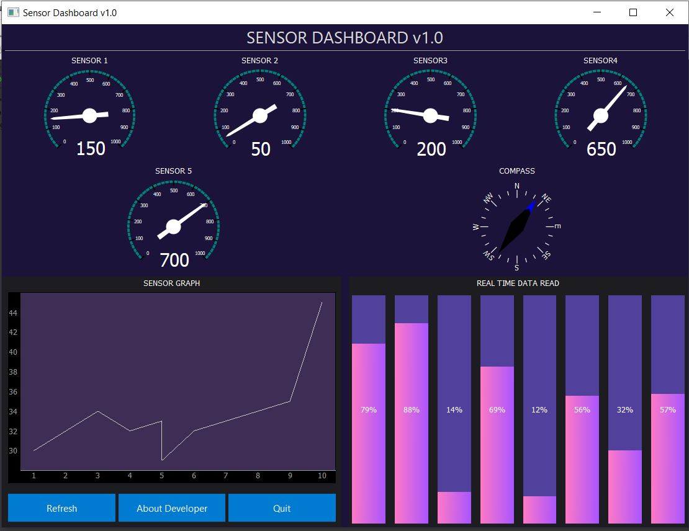

# Sensor-Dashboard
A simple PyQt5 GUI (Resizable) to show data from any where (customizable)  and represent through Gauge, Graph and Progressbar  

# Library used  
- PyQt5, pyqtgraph , numpy

Screenshot:
-----------------

